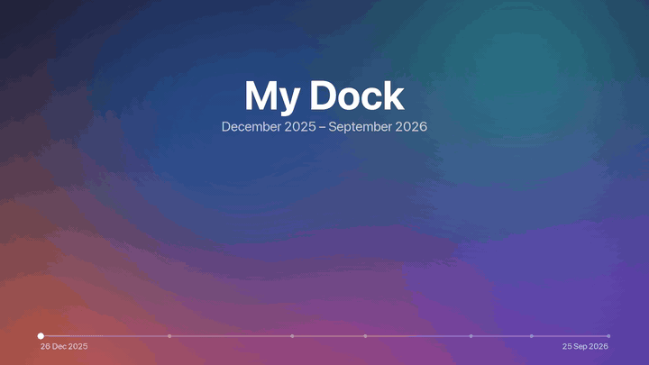
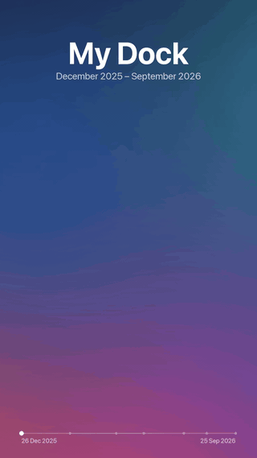
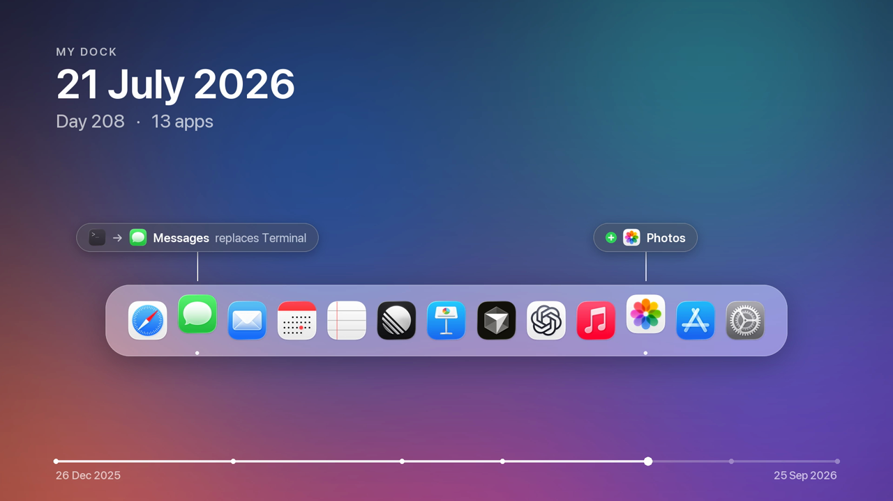
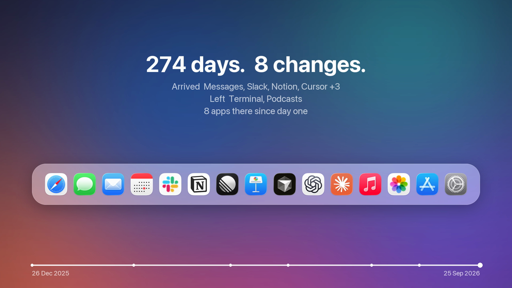
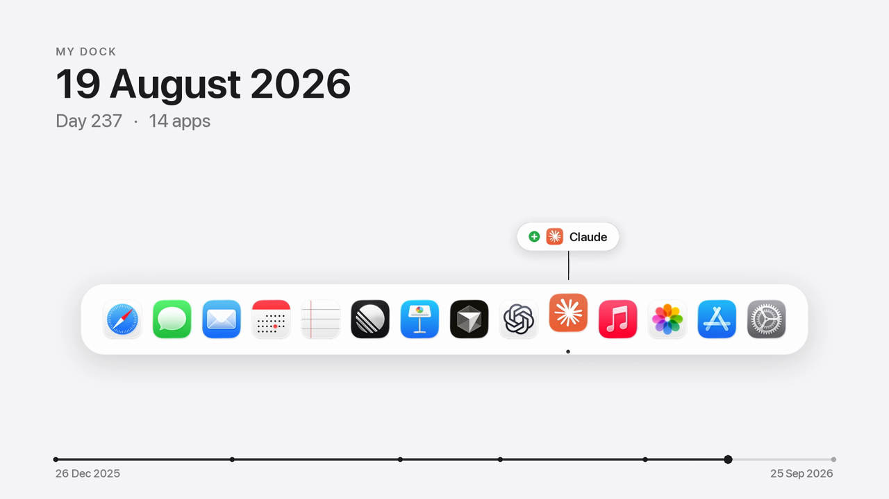
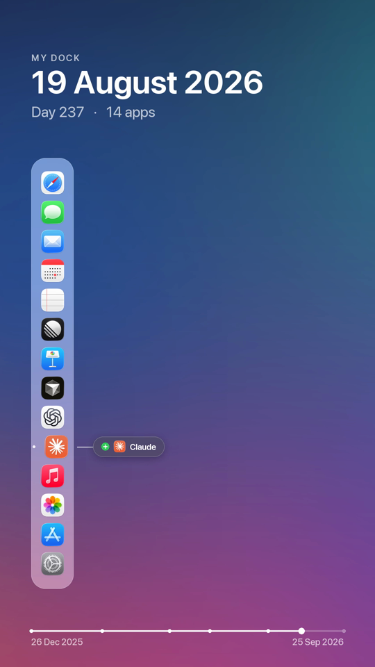

# Dock Timelapse

<!-- mcp-name: io.github.bcldvd/dock-timelapse -->

Your Dock tells the story of the tools you live in. **Dock Timelapse** records it quietly every day and
turns its evolution into an Apple-style timelapse: apps springing in, others handing over their spot,
a day counter ticking, all drawn over your own wallpaper.

<p align="center">
  
  &nbsp;
  
</p>

<sub>Demo render with an invented nine-month history. The real output is 1920×1080 and 1080×1920 H.264 at 60 fps.</sub>

| Replacements and arrivals, labelled next to the icon | End card with the story in numbers |
|---|---|
|  |  |
| **White background** (`--background white`) | **Portrait** — a vertical Dock with labels alongside |
|  |  |

## How it works

- **Records** — an hourly background agent reads the Dock's own preferences (the pinned apps, up to and
  including System Settings). On each day the Dock changes it saves a snapshot: the app list, every
  icon in high resolution, and the current wallpaper. Optionally it keeps a cropped Dock screenshot too.
- **Renders** — the videos are redrawn from that data: a glass Dock over your blurred wallpaper, spring
  animations, change labels (`+ Linear`, `Cursor replaces Xcode`), the date and day counter, and a
  progress bar scaled to real calendar time.
- **Previews on day one** — `preview` invents a plausible past that ends with your real Dock, so you can
  see your video right away.

Requirements: macOS and [uv](https://docs.astral.sh/uv/). ffmpeg comes bundled.

## Install

### Command line

```bash
uv tool install dock-timelapse

dock-timelapse install        # start recording (hourly agent, one snapshot per day of change)
dock-timelapse preview        # see your video now, with an invented past
dock-timelapse render         # later: the real timelapse → ~/Movies/Dock Timelapse/
```

### Claude Code

```text
/plugin marketplace add bcldvd/dock-timelapse
/plugin install dock-timelapse@dock-timelapse
```

The plugin brings the skill and the MCP server. Then just ask: *"start recording my Dock"*, *"make a
timelapse of my Dock"*, *"which apps did I add since June?"*

### Codex, Cursor, Gemini CLI, Copilot and other agents

The skill follows the open [Agent Skills](https://agentskills.io) format:

```bash
npx skills add bcldvd/dock-timelapse -y
```

### MCP server (Claude Desktop, Codex, Cursor, VS Code, …)

```json
{
  "mcpServers": {
    "dock-timelapse": {
      "command": "uvx",
      "args": ["dock-timelapse", "mcp"]
    }
  }
}
```

Codex (`~/.codex/config.toml`):

```toml
[mcp_servers.dock-timelapse]
command = "uvx"
args = ["dock-timelapse", "mcp"]
```

Tools: `dock_status`, `current_dock`, `dock_history`, `install_recording`, `uninstall_recording`,
`capture_now`, `render_timelapse`, `render_preview`, `render_frame`.

## Usage

```bash
dock-timelapse status                                     # recording state + every snapshot and its changes
dock-timelapse render --format portrait                   # landscape | portrait | both (default)
dock-timelapse render --background white                  # wallpaper (default) | desktop (sharp) | white
dock-timelapse preview --demo                             # a generic demo Dock
dock-timelapse still --t 2 5.5                            # single PNG frames
dock-timelapse install --screenshots                      # also keep Dock screenshots
dock-timelapse uninstall                                  # stop recording, history stays
```

Screenshots use the Screen Recording permission: `install --screenshots` prints the Python path to add in
System Settings → Privacy & Security → Screen & System Audio Recording. The videos only need the Dock data,
so this step is optional.

Data lives in `~/Library/Application Support/dock-timelapse/` (`snapshots.json`, icons, wallpapers, and
`capture.log`).

## Development

```bash
uv sync
uv run pytest
```

| module | role |
|---|---|
| `dockdata.py` | parse Dock prefs → ordered apps, up to System Settings |
| `diff.py` | added / removed / replaced / moved between two Docks |
| `store.py` | snapshots on disk, one per day of change |
| `capture.py` · `visibility.py` · `macos.py` | one capture attempt; Dock visibility; the macOS calls |
| `agent.py` | the launchd agent |
| `timeline.py` · `layout.py` | pure animation model and geometry |
| `render.py` · `video.py` | Pillow frames → ffmpeg H.264 |
| `poc.py` | invented histories for previews |
| `mcp_server.py` | MCP tools |

## License

MIT
