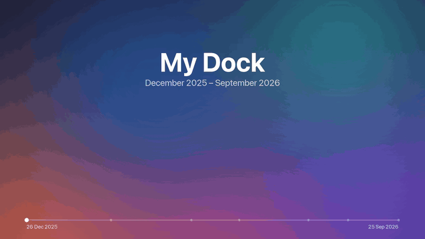
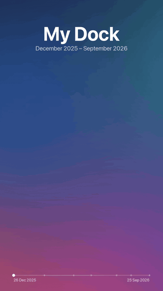
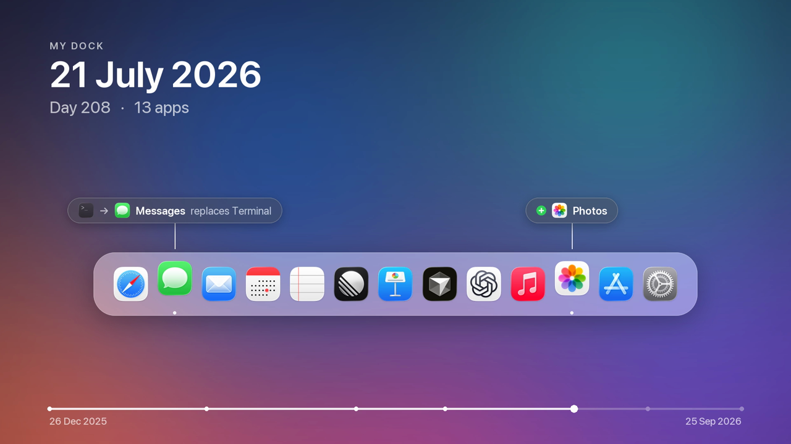
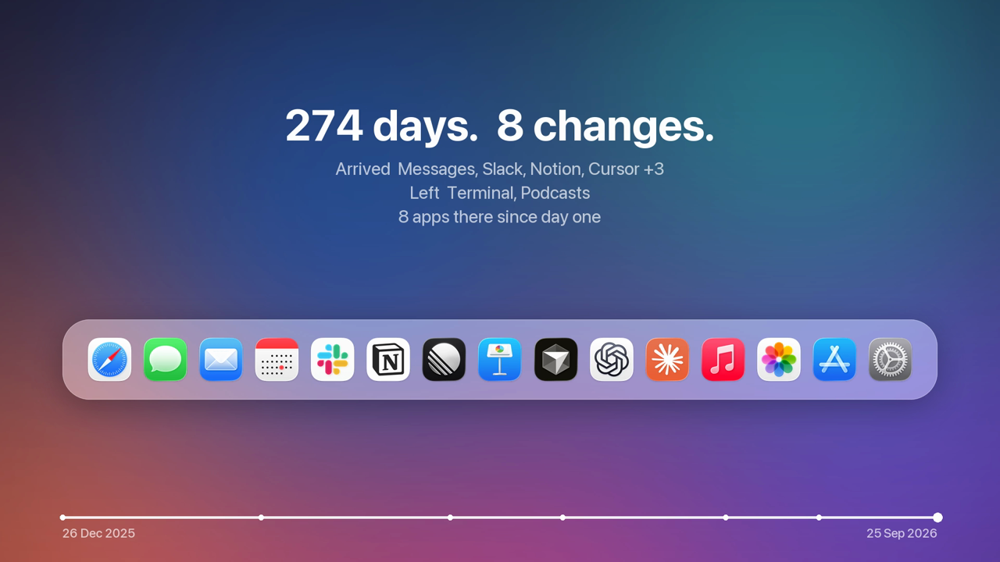
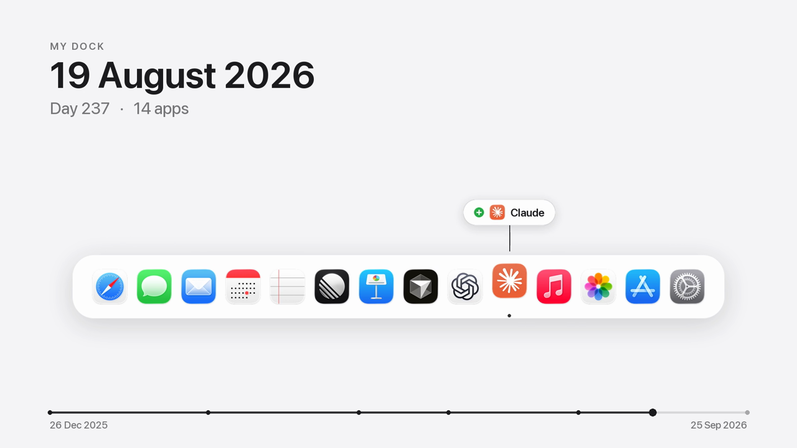
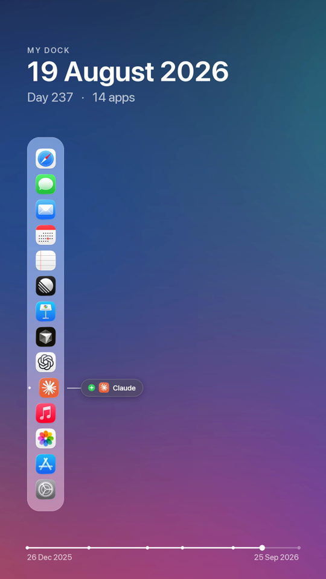

# Dock Timelapse

<!-- mcp-name: io.github.bcldvd/dock-timelapse -->

Your Dock tells the story of the tools you live in. **Dock Timelapse** records it quietly every day and
turns its evolution into an Apple-style timelapse: apps springing in, others handing over their spot,
a day counter ticking, all drawn over your own wallpaper.

<p align="center">
  
  &nbsp;
  
</p>

<sub>Demo render with an invented nine-month history. The real output is 1920×1080 and 1080×1920 H.264 at 60 fps.</sub>

| Replacements and arrivals, labelled next to the icon | End card with the story in numbers |
|---|---|
|  |  |
| **White background** (`--background white`) | **Portrait** — a vertical Dock with labels alongside |
|  |  |

## How it works

- **Records** — an hourly background agent reads the Dock's own preferences (the pinned apps, up to and
  including System Settings). On each day the Dock changes it saves a snapshot: the app list, every
  icon in high resolution, and the current wallpaper. Optionally it keeps a cropped Dock screenshot too.
- **Renders** — the videos are redrawn from that data: a glass Dock over your blurred wallpaper, spring
  animations, change labels (`+ Linear`, `Cursor replaces Xcode`), the date and day counter, and a
  progress bar scaled to real calendar time.
- **Imports your past** — if you use Time Machine, `import` reads the Dock from each of your backups and
  adds a snapshot for every day it changed, so your first video already covers months of real history.
- **Previews on day one** — no backups? `preview` invents a plausible past that ends with your real Dock, so you can
  see your video right away.

Requirements: macOS and [uv](https://docs.astral.sh/uv/). ffmpeg comes bundled.

## Install

### Mac app (recommended)

Download **Dock Timelapse.dmg** from the [latest release](https://github.com/bcldvd/dock-timelapse/releases/latest),
open it and drag **Dock Timelapse** to Applications. It lives in your menu bar: a short welcome starts
recording, offers to bring back your past from Time Machine, and makes your first video. Nothing else to
install (macOS 26 or later). The app also carries the `dock-timelapse` command and the MCP server, and
picks up any history recorded by the command-line version.

### Command line

```bash
uv tool install dock-timelapse

dock-timelapse install        # start recording (hourly agent, one snapshot per day of change)
dock-timelapse import         # add your real past from Time Machine backups (if you have them)
dock-timelapse preview        # or see your video now, with an invented past
dock-timelapse render         # later: the real timelapse → ~/Movies/Dock Timelapse/
```

### Claude Code

```text
/plugin marketplace add bcldvd/dock-timelapse
/plugin install dock-timelapse@dock-timelapse
```

The plugin brings the skill and the MCP server. Then just ask: *"start recording my Dock"*, *"make a
timelapse of my Dock"*, *"which apps did I add since June?"*

### Codex, Cursor, Gemini CLI, Copilot and other agents

The skill follows the open [Agent Skills](https://agentskills.io) format:

```bash
npx skills add bcldvd/dock-timelapse -y
```

### MCP server (Claude Desktop, Codex, Cursor, VS Code, …)

```json
{
  "mcpServers": {
    "dock-timelapse": {
      "command": "uvx",
      "args": ["dock-timelapse", "mcp"]
    }
  }
}
```

Codex (`~/.codex/config.toml`):

```toml
[mcp_servers.dock-timelapse]
command = "uvx"
args = ["dock-timelapse", "mcp"]
```

Tools: `dock_status`, `current_dock`, `dock_history`, `install_recording`, `uninstall_recording`,
`capture_now`, `import_time_machine`, `render_timelapse`, `render_preview`, `render_frame`.

## Usage

```bash
dock-timelapse status                                     # recording state + every snapshot and its changes
dock-timelapse render --format portrait                   # landscape | portrait | both (default)
dock-timelapse render --background white                  # wallpaper (default) | desktop (sharp) | white
dock-timelapse import --backups "/Volumes/Backup/Backups.backupdb/My Mac"  # read a backups folder directly
dock-timelapse preview --demo                             # a generic demo Dock
dock-timelapse still --t 2 5.5                            # single PNG frames
dock-timelapse install --screenshots                      # also keep Dock screenshots
dock-timelapse uninstall                                  # stop recording, history stays
```

`import` asks Time Machine for this Mac's backups, so connect the backup disk first. Reading backups
needs Full Disk Access for your terminal app (System Settings → Privacy & Security → Full Disk Access).
Backups thin out over time (hourly for a day, daily for a month, then weekly), so older changes land on
the date of the first backup that shows them. Past wallpapers can't be recovered: imported days use
today's. An app you have since deleted gets its icon from the copy inside the backup. Running `import`
again is safe; it never overwrites what the agent recorded live.

Screenshots use the Screen Recording permission: `install --screenshots` prints the Python path to add in
System Settings → Privacy & Security → Screen & System Audio Recording. The videos only need the Dock data,
so this step is optional.

Data lives in `~/Library/Application Support/dock-timelapse/` (`snapshots.json`, icons, wallpapers, and
`capture.log`).

## Development

The Mac app and its engine live in `mac/` (Swift package, macOS 26+, Xcode 26+):

```bash
cd mac
swift test                    # unit, parity, golden-frame and encoder tests
scripts/build-app.sh          # → build/Dock Timelapse.app (signed with your Apple Development identity)
scripts/make-dmg.sh           # → build/Dock-Timelapse-<version>.dmg (notarized when NOTARY_* is set)
open "build/Dock Timelapse.app" --args --demo --welcome   # UI review without touching login items
```

| target | role |
|---|---|
| `DockCore` | Dock parsing, diff, store, timeline, layout, Time Machine import, previews |
| `DockMac` | Dock prefs, icons, wallpaper, `tmutil`, Full Disk Access, background recording |
| `DockRender` | Core Graphics frames, AVFoundation H.264 |
| `DockMCP` | MCP server (stdio) |
| `DockAppModel` · `DockTimelapseApp` | app logic (tested) · SwiftUI |
| `DockTimelapseCLI` | `dock-timelapse` |

The Python engine below is the reference the Swift port is tested against:
`uv run python scripts/gen_swift_fixtures.py` regenerates the parity fixtures.

```bash
uv sync
uv run pytest
```

| module | role |
|---|---|
| `dockdata.py` | parse Dock prefs → ordered apps, up to System Settings |
| `diff.py` | added / removed / replaced / moved between two Docks |
| `store.py` | snapshots on disk, one per day of change |
| `capture.py` · `visibility.py` · `macos.py` | one capture attempt; Dock visibility; the macOS calls |
| `agent.py` | the launchd agent |
| `timeline.py` · `layout.py` | pure animation model and geometry |
| `render.py` · `video.py` | Pillow frames → ffmpeg H.264 |
| `timemachine.py` | import past Docks from Time Machine backups |
| `poc.py` | invented histories for previews |
| `mcp_server.py` | MCP tools |

## License

MIT
